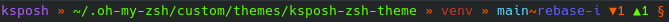

# ksposh-zsh-theme

Theme based of [half-life](https://github.com/ohmyzsh/ohmyzsh/blob/master/themes/half-life.zsh-theme) for zsh.

Links for feature inspirations are present in the script's header.

Supports the following prompt displays:

- Active Python virtual environment (_currently not working as intended_)
- Git active branch and action information
- Git staged/unstaged change number and indicators
- Git untracked file indicator

Prompt is easily editable, and you can comment out any feature that you don't want.

Example with every feature active:

## Installation

    cp ksposh.zsh-theme <YOUR>/<ZSH>/<CONFIG>/<LOCATION>

